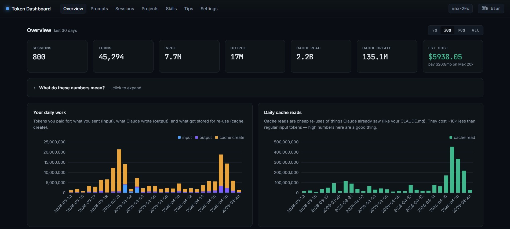
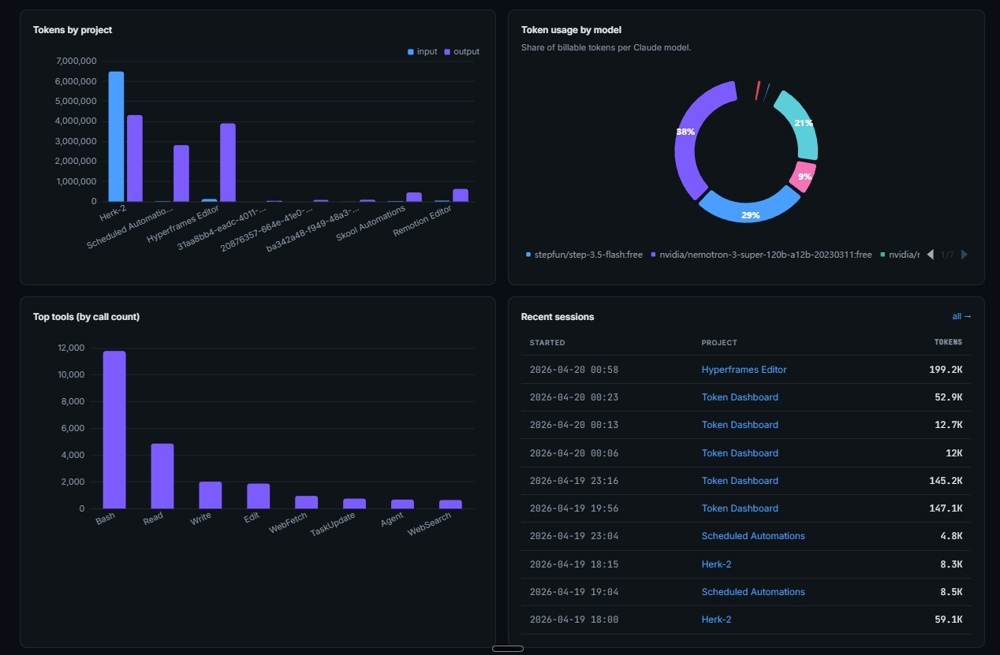

# ThermDash

**ThermDash** is a local-first dashboard that turns AI usage into thermodynamic and economic insight. It scans your AI chat history, estimates the energy consumed by each request, converts that energy into heat dissipated, pairs it with cost and answer-quality metrics, and serves everything in an interactive local web dashboard.

Think of it as a **thermal audit trail for your AI workflows** — where thermodynamics meets token accounting.




## Why

Every AI request has a physical footprint: energy in, heat out, dollars spent, and a quality score you can actually use. Most tools stop at token counts or API bills. ThermDash goes further up the ladder — from raw chat logs to a thermodynamic view of your AI usage — so you can see **what you spent, what it cost, and what you got** in one place.

It is built around a *metrics ladder*: each rung turns a lower-level signal into a higher-level decision aid.

## Features

- **Usage scanning** — walks your local AI chat history, parses sessions, deduplicates, and supports incremental rescans.
- **Energy estimation** — per-request and per-model energy consumption via a configurable energy table and an EcoLogits bridge.
- **Thermodynamics** — converts consumed energy into heat dissipated and per-session heat deltas.
- **Cost accounting** — model pricing table (`pricing.json`) turns tokens into dollars.
- **Quality scores** — scores answers so efficiency can be judged against usefulness, not just raw spend.
- **Actionable tips** — generates concrete recommendations for reducing waste.
- **Persistent storage** — SQLite database with schema migrations.
- **Local web dashboard** — Python server plus an ECharts frontend, no cloud involved.
- **CLI** — drive scans, queries, and reporting from the command line.

## How It Works

```
chat logs ──▶ scanner ──▶ SQLite DB ──▶ energy table / ecologits bridge
                                            │
                                            ▼
                              thermodynamics (heat, ΔHeat)
                                            │
                              pricing ──▶ cost per request
                                            │
                              quality scores ──▶ tips
                                            │
                                            ▼
                                  local web dashboard
```

1. The **scanner** walks your AI chat history, parses and deduplicates sessions, and stores them in SQLite.
2. The **energy table** and **EcoLogits bridge** estimate the energy consumed per request for the model used.
3. The **thermodynamics** modules convert energy into heat dissipated and per-session heat deltas.
4. **Pricing** converts token counts into cost using `pricing.json`.
5. **Quality scores** rate the usefulness of answers, and **tips** translate the combined metrics into recommendations.
6. The **server** serves the ECharts dashboard so you can explore it all interactively.

## Getting Started

### Prerequisites

- Python 3.10+

### Install and run

```bash
git clone https://github.com/Centrale73/ThermDash.git
cd ThermDash
python -m venv .venv
source .venv/bin/activate   # Windows: .venv\Scripts\activate

# Explore the CLI
python cli.py --help

# Launch the local dashboard
python cli.py serve
```

> If the `serve` subcommand differs on your checkout, check `python cli.py --help` — the CLI is the source of truth.

### Data files

- `pricing.json` — per-model pricing used for cost estimation
- `energy.json` — per-model energy intensity used for energy estimation

## Project Structure

| Path | Purpose |
| --- | --- |
| `cli.py` | Command-line entry point |
| `token_dashboard/scanner.py` | Chat-history discovery, parsing, dedup, rescan |
| `token_dashboard/db.py` | SQLite storage and migrations |
| `token_dashboard/ecologits_bridge.py` | EcoLogits-based impact estimation |
| `token_dashboard/energy_table.py` | Energy lookup table |
| `token_dashboard/thermodynamics.py` | Energy → heat conversion |
| `token_dashboard/delta_heat.py` | Per-session heat deltas |
| `token_dashboard/heat.py` | Heat aggregation |
| `token_dashboard/pricing.py` | Cost estimation |
| `token_dashboard/quality_scores.py` | Answer quality scoring |
| `token_dashboard/tips.py` | Recommendation engine |
| `token_dashboard/skills.py` | Skill tracking |
| `token_dashboard/chat.py` | Chat/session models |
| `token_dashboard/server.py` | Local web server |
| `web/` | ECharts dashboard frontend |
| `tests/` | Pytest test suite |

## Metrics Ladder (v1)

The first metrics ladder ships with three rungs:

1. **Energy table** — energy per request and per model.
2. **Thermodynamics** — heat dissipated and ΔHeat per session.
3. **Quality scores** — usefulness-weighted efficiency.

See [`docs/specs/thermodynamic-efficiency-spec.md`](docs/specs/thermodynamic-efficiency-spec.md) for the full specification.

## Validation

- `test_perplexity_impacts.py` validates impact estimates against real usage data (`perplexity_impact_results.json`).
- `tests/` covers the scanner, database and migrations, energy table, pricing, thermodynamics, quality scores, tips, skills, server, and end-to-end totals.

Run the suite:

```bash
pytest
```

## Documentation

- [`docs/specs/thermodynamic-efficiency-spec.md`](docs/specs/thermodynamic-efficiency-spec.md) — thermodynamic efficiency specification
- [`docs/KNOWN_LIMITATIONS.md`](docs/KNOWN_LIMITATIONS.md) — known limitations
- [`docs/inspiration.md`](docs/inspiration.md) — background and inspiration
- [`CONTRIBUTING.md`](CONTRIBUTING.md) — how to contribute

## Roadmap

- Metrics ladder v2 and beyond — see the `feature/*` branches for in-flight work
- Broader model coverage in the energy and pricing tables
- More dashboard views

## License

This project is licensed under the MIT License — see the [LICENSE](LICENSE) file for details.
